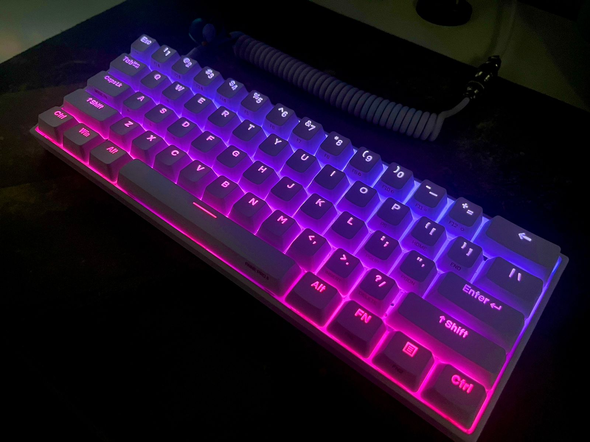

# Dracula for [Anne Pro 2](https://www.hexcore.xyz/annepro2)

> A dark theme for [Anne Pro 2](https://www.hexcore.xyz/annepro2).

## Install

All instructions can be found at [draculatheme.com/anne-pro-2](https://draculatheme.com/anne-pro-2).

## Team

This theme is maintained by the following person(s) and a bunch of [awesome contributors](https://github.com/dracula/anne-pro-2/graphs/contributors).

|  |  |   |  |
| ---------------------------------------------------------------------------------------- | --------------------------------------------------------------------------------------------- | -------------------------------------------------------------------------------------------- | ------------------------------------------------------------------------------------------- |
| [Zeno Rocha](https://github.com/zenorocha)                                               | [Lucas de França](https://github.com/luxonauta)                                               | [Gildásio Júnior](https://github.com/gildasio)                                               | [Anisio Santos](https://github.com/anisiosts)                                               |

## Community

- [Twitter](https://twitter.com/draculatheme) - Best for getting updates about themes and new stuff.
- [GitHub](https://github.com/dracula/dracula-theme/discussions) - Best for asking questions and discussing issues.
- [Discord](https://draculatheme.com/discord-invite) - Best for hanging out with the community.

## License

[MIT License](./LICENSE)
